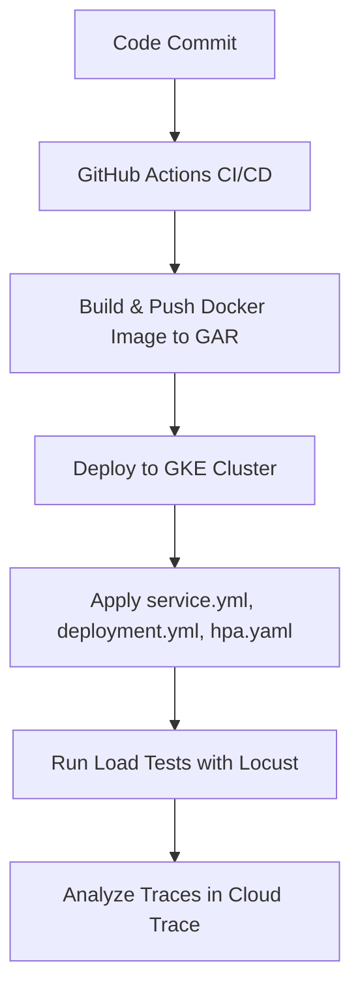

# 🚀 MLOps Assignment: Scaling a Real-Time Iris Classification API

## 📌 1. Objective

The objective of this assignment was to evolve a basic machine learning API into a **scalable**, **observable**, and **production-grade** service. We achieved this by:

* Enhancing the FastAPI-based ML model with observability using **OpenTelemetry**
* Deploying the containerized application to **Google Kubernetes Engine (GKE)**
* Implementing **Horizontal Pod Autoscaling (HPA)**
* Performing **load testing with Locust** to evaluate scaling behavior and performance bottlenecks

---

## ⚙️ 2. Project Overview

This project establishes a complete MLOps pipeline that includes:

* ✅ **Containerization** with Docker
* 🔁 **CI/CD** automation via GitHub Actions
* ☁️ **Cloud deployment** to GKE
* 🔍 **Observability** using OpenTelemetry and Google Cloud Trace
* 📈 **Autoscaling** using Kubernetes HPA
* 🧪 **Load testing** using Locust

### 📊 Architecture Flow



---

## 🧱 3. Core Components

### `main.py` – FastAPI Application

* Serves predictions from a pre-trained **Scikit-learn Iris Classifier**
* Instrumented with **OpenTelemetry** for traceability and performance monitoring

```python
from opentelemetry import trace
from opentelemetry.instrumentation.fastapi import FastAPIInstrumentor
from opentelemetry.sdk.trace import TracerProvider
from opentelemetry.sdk.trace.export import BatchSpanProcessor
from opentelemetry.exporter.otlp.proto.grpc.trace_exporter import OTLPSpanExporter

# Tracer setup
provider = TracerProvider()
processor = BatchSpanProcessor(OTLPSpanExporter())
provider.add_span_processor(processor)
trace.set_tracer_provider(provider)
tracer = trace.get_tracer(__name__)

app = FastAPI(title="Iris Classifier API")
FastAPIInstrumentor.instrument_app(app)

@app.post("/predict/")
def predict_species(payload: IrisInput):
    input_df = pd.DataFrame([payload.dict()])
    with tracer.start_as_current_span("model_prediction_span") as span:
        prediction = model.predict(input_df)[0]
        span.set_attribute("prediction.class", prediction)
    return {"prediction_class": prediction}
```

---

### `k8s/deployment.yml` – Kubernetes Deployment Manifest

Includes resource requests and limits necessary for **HPA to monitor CPU usage**.

```yaml
apiVersion: apps/v1
kind: Deployment
metadata:
  name: iris-deployment
spec:
  replicas: 2
  template:
    spec:
      containers:
      - name: iris-api
        image: <your-image-url>
        ports:
        - containerPort: 8100
        resources:
          requests:
            cpu: "250m"
          limits:
            cpu: "500m"
```

---

### `k8s/hpa.yaml` – Horizontal Pod Autoscaler

Scales pods based on average CPU utilization.

```yaml
apiVersion: autoscaling/v2
kind: HorizontalPodAutoscaler
metadata:
  name: iris-hpa
spec:
  scaleTargetRef:
    apiVersion: apps/v1
    kind: Deployment
    name: iris-deployment
  minReplicas: 2
  maxReplicas: 10
  metrics:
    - type: Resource
      resource:
        name: cpu
        target:
          type: Utilization
          averageUtilization: 50
```

---

## 🧪 4. Execution and Results

### 🔄 Load Testing with Locust

Two phases of testing were conducted:

* **Phase 1:** 150 concurrent users
* **Phase 2:** 300 concurrent users

### 📈 HPA Scaling Behavior

* **Scaled from 2 to 6 pods** under 150-user load
* **Maxed at 10 pods** under 300-user load
* **CPU utilization stabilized** near the target threshold of 50%

### 📊 Performance Summary

| Metric                 | 150 Users | 300 Users | Insight                              |
| ---------------------- | --------- | --------- | ------------------------------------ |
| **Failures**           | 0 (0.00%) | 0 (0.00%) | Perfect reliability                  |
| **Throughput (req/s)** | 93.50     | 182.39    | Near-linear scaling                  |
| **Median Latency**     | 57 ms     | 56 ms     | Consistent user experience           |
| **P95 Latency**        | 170 ms    | 120 ms    | Improved under load due to warm pods |

### 🔍 OpenTelemetry Trace Analysis

* `model_prediction_span` consistently under **5ms**
* Majority of time spent in **network I/O** and **API overhead**
* Confirms the **model is not the bottleneck**

---

## ✅ 5. Conclusion

This project successfully transforms a basic model-serving API into a **scalable**, **observable**, and **cloud-native** service.

### 🔑 Key Takeaways

* **CI/CD is essential** for repeatable and reliable deployment
* **HPA works beautifully**, scaling to demand in real time
* **Observability is critical** to distinguish between model vs infra bottlenecks
* **System is highly performant** even under 300-user concurrency, with headroom to scale further

---


